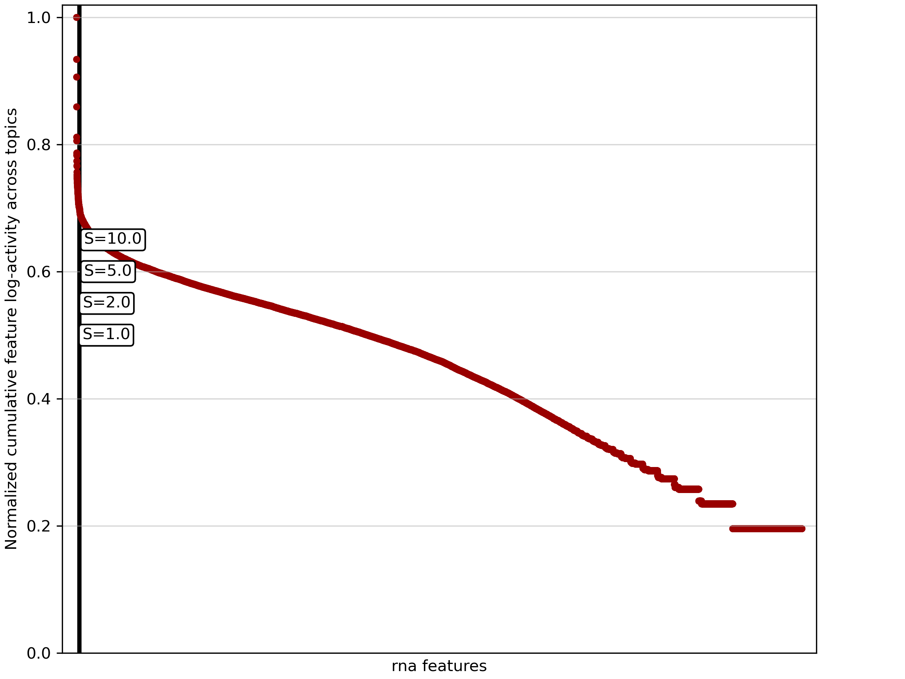

```{r, include = FALSE}
knitr::opts_chunk$set(
  collapse = TRUE,
  comment = "#>"
)
```

Welcome to this tutorial on using the `mTopic` R package to prepare data for multimodal topic modeling of single-cell data. The `mTopic` package enables you to perform both spatial and non-spatial multimodal topic modeling, allowing you to uncover complex patterns across multiple modalities, such as ATAC, RNA, and protein, in single-cell experiments.

Data preprocessing is a critical first step in any single-cell analysis pipeline. Proper preprocessing ensures that the data is clean, well-structured, and ready for modeling. It helps remove noise, normalize counts, and standardize features across modalities, ensuring the results are biologically meaningful and statistically robust. In this tutorial, we will demonstrate how to preprocess a multimodal dataset to prepare it for topic modeling using `mTopic`. We will:

 - Load Seurat data stored in the rds format.
 - Perform quality control to filter low-quality cells and features.
 - Normalize and scale the data for cross-modality comparability.
 - Extract relevant features.

We use a publicly available dataset from GEO ([GSE218593](https://www.ncbi.nlm.nih.gov/geo/query/acc.cgi?acc=GSE218593) and [GSE205055](https://www.ncbi.nlm.nih.gov/geo/query/acc.cgi?acc=GSE205055)), which includes ATAC and RNA measurements from P22 mouse brain.  A preprocessed .rds file version of this dataset is available at [Zenodo](https://zenodo.org/records/15472980).

Before we begin, let’s import all the necessary libraries and set the working directory.

```{r message = FALSE, warning = FALSE}
library(mTopic)
library(Seurat)

dataset_name <- "P22_Mouse_Brain_ATAC_RNA_raw.rds"
working_dir <- '~/projects/datasets/'

if(!file.exists(paste0(working_dir, dataset_name))){
  download.file(
    url = paste0("https://zenodo.org/records/15472980/files/", dataset_name, "?download=1"), 
    destfile = paste0(working_dir, dataset_name), 
    mode = "wb"
  )
}
```

The `mTopic` R package is designed to work with Seurat objects, which are specialized data structures for handling multimodal single-cell data.

```{r}
p22 <- readRDS(paste0(working_dir, dataset_name))
```

The loaded Seurat object `p22`, which contains raw ATAC and RNA data from P22 mouse brain.

```{r}
p22
```

The wrapper relies on a Seurat v5 object. Please ensure that the assays in your dataset are of class `Assay5`. If they are of class `Assay`, use the `update_assays` function before proceeding with the analysis.

```{r}
lapply(p22@assays, function(assay) class(assay)[1])
#object <- update_assays(object)
```

Before running topic modeling, the data must be preprocessed to ensure it is clean, informative, and suitable for analysis. The filtering pipeline includes the following steps:

 - **Permutation of counts (`permute`).** Randomizes cell counts within each feature to estimate technical noise and identify overrepresented features.
 - **Transformation of count matrices.** A **TF-IDF transformation (`tfidf`)**, used for ATAC/histone modification/RNA data adjusts raw feature counts by balancing their frequency and importance, making rare but biologically relevant features more prominent. A **CLR normalization (`clr`)**, used for protein data, normalizes the count matrices by addressing compositional biases, ensuring that protein-level data is standardized across cells.
 - **Scaling counts (`scale_counts`).** Scales total counts across modalities to ensure equal contribution during modeling.

Permutation-based preprocessing helps highlight overrepresented features, reducing the risk of technical artifacts influencing results.

```{r}
p22 <- tfidf(p22, mod = 'rna')
p22 <- tfidf(p22, mod = 'atac')
p22 <- scale_counts(p22)
p22
```

The data is now ready for an initial round of topic modeling aimed at filtering and identifying technical noise and overrepresented features. If working with a large dataset, consider selecting a representative subset of cells to reduce runtime. For smaller datasets, such as the one used here, which contains 9,215 spatial spots, the filtering model can be trained on the full dataset.

```{r}
mtm_model <- MTM(p22, n_topics = 10, n_jobs = 100)
mtm_model <- VI(mtm_model, n_iter = 30)
```

After training the filtering-oriented model, the next step is to identify features that are overrepresented across topics. These features often have the highest cumulative activity across all topics and may contribute more to technical noise than to meaningful biological insights.

We apply a knee detection algorithm to filter them, which identifies a sharp drop in cumulative feature activity and defines a cutoff point for filtering. The sensitivity of this detection is controlled by the `knee_sensitivity` parameter (`S`), which determines how pronounced the drop must be to qualify as a knee. Lower values of `S` result in more aggressive filtering, while higher values yield more conservative thresholds.

For example, below is a knee plot for the RNA modality, showing the distribution of feature activity and the detected cutoff.

```{r}
plot_filter_var_knee(mtm_model, mod = 'rna')
```

```{r echo=FALSE, out.width="100%"}
plot_filter_var_knee(mtm_model, mod = 'rna', save = 'tutorial1_plot1.png')

```

In datasets with many features, the knee point may be challenging to detect due to the dense distribution of activity values. To improve visibility, you can limit the plot to the top-scoring features by adjusting the `show_frac` parameter.

The `show_frac` parameter controls the fraction of features to display, focusing on those with the highest cumulative activity across topics. Reducing this fraction can make the knee point more apparent, simplifying the selection of features to filter for a cleaner and more interpretable analysis.

```{r}
plot_filter_var_knee(mtm_model, mod = 'rna', show_frac = 0.01)
```

```{r echo=FALSE, out.width="100%"}
plot_filter_var_knee(mtm_model, mod = 'rna', show_frac = 0.01, save = 'tutorial1_plot2.png')
knitr::include_graphics('tutorial1_plot2.png')
```

Once the appropriate `knee_sensitivity` values have been selected for each modality, you can filter out the overrepresented features using the `filter_var_knee` function. This step refines the dataset by removing features that contribute primarily to noise.

```{r}
p22_filtered <- filter_var_knee(p22, model = mtm_model, knee_sensitivity = 5)
p22_filtered
```

Alternatively, if you have a predefined list of features to retain, you can use the `filter_var_list` function. This method allows precise control over which features are preserved in the dataset.

If RNA is one of the data modalities, we recommend further refining the feature set by selecting highly variable genes (HVGs). HVGs exhibit the most significant variability across cells and often carry the most biologically relevant signal.

```{r}
p22_rna <- p22_filtered[['rna']]
p22_rna <- Seurat::FindVariableFeatures(p22_rna, nfeatures = 10000)

p22_atac <- p22_filtered[['atac']]
p22_atac <- Seurat::FindVariableFeatures(p22_atac, nfeatures = 10000)

selected_genes <- Seurat::VariableFeatures(p22_rna)
selected_peaks <- Seurat::VariableFeatures(p22_atac)

p22_filtered <- filter_var_list(p22, var = c(selected_genes, selected_peaks))
```

Make sure to save the processed object after filtering to be used for downstream topic model training.

```{r eval = FALSE}
#saveRDS(p22_filtered, file = paste0(working_dir, 'P22_Mouse_Brain_ATAC_RNA_filtered.rds'))
```
