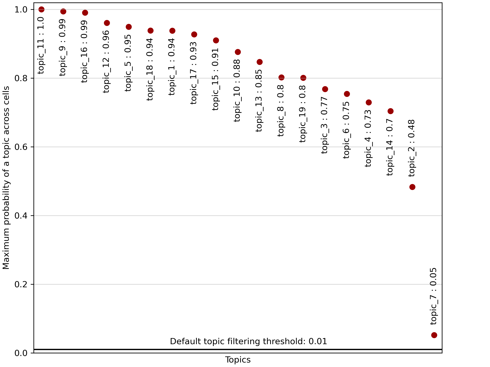
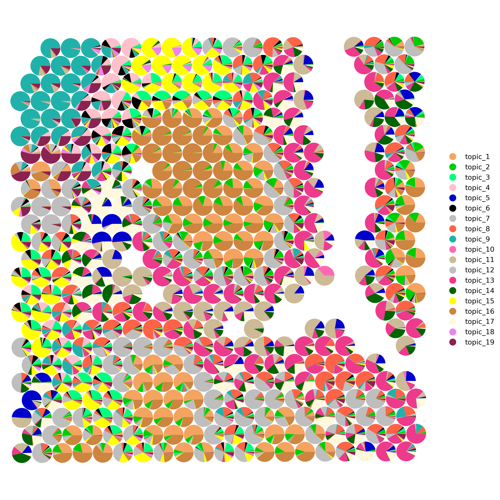

```{r, include = FALSE}
knitr::opts_chunk$set(
  collapse = TRUE,
  comment = "#>"
)
```

Welcome to the tutorial on using the `mTopic` package for spatial multimodal topic modeling of human tonsils dataset. We use a publicly available [dataset from 10x Genomics](https://www.10xgenomics.com/datasets/gene-protein-expression-library-of-human-tonsil-cytassist-ffpe-2-standard), which includes RNA and protein epitope measurements.

Let’s begin by importing the required libraries for this analysis. The filtered training data is available at [Zenodo](https://zenodo.org/records/15472980).

```{r message = FALSE, warning = FALSE}
library(mTopic)
library(Seurat)

dataset_name <- "Human_Tonsil_RNA_Protein_filtered.rds"
working_dir <- '~/projects/datasets/'

if(!file.exists(paste0(working_dir, dataset_name))){
  download.file(
    url = paste0("https://zenodo.org/records/15472980/files/", dataset_name, "?download=1"), 
    destfile = paste0(working_dir, dataset_name), 
    mode = "wb"
  )
}
```

# Spatial Multimodal Topic Modeling

Load the prefiltered `Seurat` object with the human tonsils dataset. The dataset comprises 4,194 spatial spots and two modalities, `rna` (gene expression) and `prot` (protein levels).

```{r}
ton <- readRDS(paste0(working_dir, dataset_name))
```

Before we train the spatial Multimodal Topic Model (`sMTM`), it is essential to preprocess the data to improve the model’s ability to identify meaningful patterns across modalities.

To ensure comparability between RNA and protein data, we apply the following normalization and scaling steps:

 - **TF-IDF transformation for RNA (`tfidf`).** Adjusts raw gene expression counts by balancing feature frequency and importance, emphasizing rare but informative genes.
 - **CLR normalization for protein (`clr`).** Corrects compositional biases by normalizing protein counts across cells using the Centered Log Ratio method.
 - **Scaling across modalities (`scale_counts`).** Linearly scales counts to ensure all modalities contribute equally during topic modeling, preventing one from dominating the analysis.

```{r}
ton <- tfidf(ton, mod = 'rna')
ton <- clr(ton, mod = 'prot')
ton <- scale_counts(ton)
```

Now that the data is preprocessed, we can train the spatial Multimodal Topic Model (`sMTM`). Initialize and train the model.

```{r}
smtm_model <- sMTM(ton, n_topics = 19, radius = 0.02, n_jobs = 100)
smtm_model <- VI(smtm_model, n_iter = 20)
```

After training, export the learned parameters to the Seurat object the using `export_params` function:

```{r}
ton <- export_params(smtm_model, ton)
ton
```

The `export_params`. function not only exports model parameters but can also filter out insignificant topics based on their overall contribution. Topic filtering: Set `filter_topics = TRUE` to automatically remove topics with low overall activity. The `filter_threshold` parameter controls the minimum average topic proportion required to retain a topic.

This helps remove spurious or noise-driven topics, simplifying downstream interpretation and visualization.

```{r}
plot_filter_topics(smtm_model)
```

```{r  echo = FALSE, out.width = "100%"}
plot_filter_topics(smtm_model, save = 'tutorial3_plot1.png')

```

By preprocessing the data, training the `sMTM` model, and exporting the learned parameters, we have set the stage for a comprehensive analysis of cellular heterogeneity.

# Visualizing Topic Proportions

Visualizing topic distribution across cells or spatial spots is key in interpreting topic modeling results. These proportions reflect the contribution of each topic to each cell. They can reveal spatially organized cell states, types, or biological processes.

To visualize topic proportions, use the `plot_topics` function to generate scatter plots where each cell or spot is colored according to the value of a selected topic. This reveals spatial patterns and gradients that help interpret biological variation within the tissue.

For example, if a topic captures a specific cell type, the plot will highlight regions enriched in that population.

```{r}
plot_topics(ton, x = 'Spatial')
```

```{r echo = FALSE, out.width = "100%"}
plot_topics(ton, x = 'Spatial', save = 'tutorial3_plot2.png')
knitr::include_graphics('tutorial3_plot2.png')
```

To visualize overall trends in topic distributions, use the `plot_dominant_topics` function. This function assigns each cell or spot to its most dominant topic — the one with the highest proportion — and colors it accordingly.

The resulting plot provides a global overview of topic dominance across the tissue, helping you quickly identify regions enriched in specific topics. These regions may correspond to distinct cell types, tissue structures, or gradients of biological activity.

This visualization is handy for detecting the tissue’s spatial domains and functional zones.

```{r}
palette <- list(
  'topic_1'  = '#F4A460', 'topic_2'  = '#00CD00', 'topic_3'  = '#00FF7F', 
  'topic_4'  = '#FFC0CB', 'topic_5'  = '#0000CD', 'topic_6'  = '#000000',
  'topic_7'  = '#BEBEBE', 'topic_8'  = '#FF6347', 'topic_9'  = '#20B2AA',
  'topic_10' = '#FF69B4', 'topic_11' = '#CDBA96', 'topic_12' = '#BEBEBE',
  'topic_13' = '#EE3A8C', 'topic_14' = '#006400', 'topic_15' = '#FFFF00',
  'topic_16' = '#CD853F', 'topic_17' = '#FFF8DC', 'topic_18' = '#EE82EE',
  'topic_19' = '#8B2252'
)

plot_dominant_topics(ton, x = 'Spatial', marker = 'h', s = 30, palette = palette)
```

```{r echo = FALSE, out.width = "100%"}
plot_dominant_topics(ton, x = 'Spatial', marker = 'h', s = 30, palette = palette, save = 'tutorial3_plot3.png')
knitr::include_graphics('tutorial3_plot3.png')
```

Alternatively, you can explore topic proportions in more detail using pie chart scatter plots with  `plot_scatter_pie`. This function visualizes the complete topic composition of each cell or spot as a pie chart.

```{r}
plot_scatter_pie(ton, x = 'Spatial', radius = 0.0073, palette = palette)
```

```{r echo = FALSE, out.width = "100%"}
plot_scatter_pie(ton, x = 'Spatial', radius = 0.0073, palette = palette, save = 'tutorial3_plot4.png')
knitr::include_graphics('tutorial3_plot4.png')
```

Rendering may take time, especially for large datasets. To improve performance and focus on a specific region, you can limit the number of visualized spots using the `xrange` and `yrange` parameters (default: `c(0, 1)`), which define the fraction of the spatial extent to display.

```{r}
plot_scatter_pie(ton, x = 'Spatial', radius = 0.0073, palette = palette, xrange = c(0.3, 0.6), yrange = c(0.35, 0.65))
```

```{r echo = FALSE, out.width = "100%"}
plot_scatter_pie(ton, x = 'Spatial', radius = 0.0073, palette = palette, , xrange = c(0.3, 0.6), yrange = c(0.35, 0.65), save = 'tutorial3_plot5.png')

```

To interpret the results of the `sMTM` model, it is important to examine the feature signatures associated with each topic. Use the `plot_signatures` function to visualize the top features per topic. This function generates a set of plots, each showing the most significant features ranked by their importance for a given topic. These visualizations help reveal which molecular markers distinguish topics, aiding in biological interpretation and annotation of the results.

```{r}
plot_signatures(ton, mod = 'rna', n_top = 20)
```

```{r echo = FALSE, out.width = "100%"}
plot_signatures(ton, mod = 'rna', n_top = 20, save = 'tutorial3_plot6.png')
knitr::include_graphics('tutorial3_plot6.png')
```

```{r}
plot_signatures(ton, mod = 'prot', n_top = 10, figsize = c(10, 8))
```

```{r echo = FALSE, out.width = "100%"}
plot_signatures(ton, mod = 'prot', n_top = 10, figsize = c(10, 8), save = 'tutorial3_plot7.png')
knitr::include_graphics('tutorial3_plot7.png')
```

This concludes the example application of `mTopic` for modeling spatial multimodal single-cell data, demonstrated using the human tonsil dataset.

```{r eval = FALSE}
#saveRDS(ton, paste0(working_dir, 'Human_Tonsil_RNA_Protein_trained.rds'))
```
