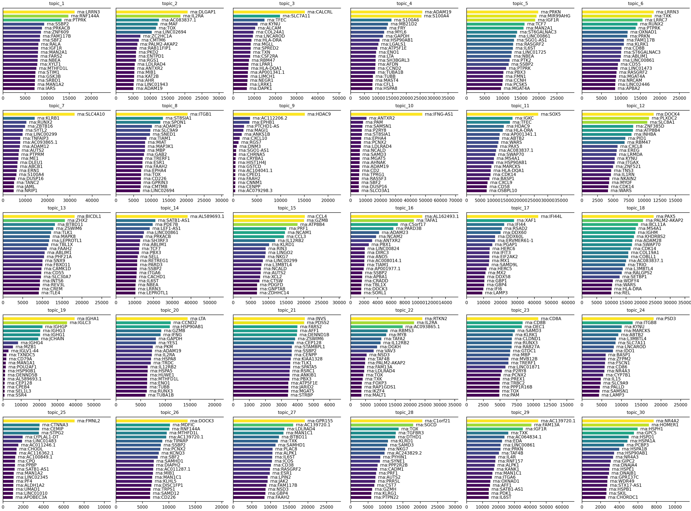
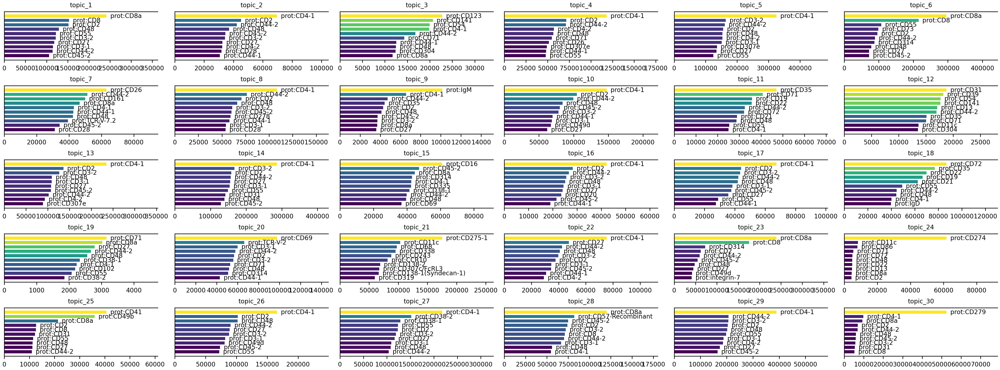

```{r, include = FALSE}
knitr::opts_chunk$set(
  collapse = TRUE,
  comment = "#>"
)
```

Welcome to this tutorial on using the `mTopic` package for non-spatial multimodal topic modeling of human peripheral blood mononuclear cells (PBMC), using the [DOGMA-seq dataset](https://www.nature.com/articles/s41587-021-00927-2). We use a publicly available dataset from [GEO](https://www.ncbi.nlm.nih.gov/geo/query/acc.cgi?acc=GSE166188), which includes ATAC, RNA, and protein epitope measurements.

Let’s begin by importing the required libraries and downloading the filtered training data, available at [Zenodo](https://zenodo.org/records/15472980).

```{r message = FALSE, warning = FALSE}
library(mTopic)
library(Seurat)

dataset_name <- "Human_PBMC_ATAC_RNA_Protein_filtered.rds"
working_dir <- '~/projects/datasets/'

if(!file.exists(paste0(working_dir, dataset_name))){
  download.file(
    url = paste0("https://zenodo.org/records/15472980/files/", dataset_name, "?download=1"), 
    destfile = paste0(working_dir, dataset_name), 
    mode = "wb"
  )
}
```

# Non-Spatial Multimodal Topic Modeling

The filtered dataset contains 7,349 cells and includes three modalities:

 - `atac`: chromatin accessibility data (Assay for Transposase-Accessible Chromatin),
 - `rna`: gene expression data,
 - `prot`: protein abundance data.

This rich multimodal structure enables integrated modeling of transcriptional activity, regulatory accessibility, and surface protein expression at single-cell resolution.

```{r}
pbmc <- readRDS(paste0(working_dir, dataset_name))
pbmc
```

To prepare the dataset for topic modeling, we need to transform and scale the raw counts across all modalities:

 - TF-IDF transformation (`tfidf`) for `atac` and `rna`. Emphasizes informative, modality-specific features by balancing frequency and importance.
 - CLR normalization (`clr`) for `prot`. Corrects compositional bias in protein counts across cells.

After normalization, apply `scale_counts` to scale total counts across modalities, ensuring balanced contribution to the topic model.

```{r}
pbmc <- tfidf(pbmc, mod = 'atac')
pbmc <- tfidf(pbmc, mod = 'rna')
pbmc <- clr(pbmc, mod = 'prot')
pbmc <- scale_counts(pbmc)
```

To train a non-spatial topic model using `MTM`, define the model, run Variational Inference (`VI`) for 500 iterations, and export the trained parameters to the `pbmc` object.

While we use 500 iterations in this tutorial for thorough training, the model often converges to meaningful topics in as few as 20 iterations. You can adjust the number of iterations based on dataset size and desired precision.

```{r}
mtm_model <- MTM(pbmc, n_topics = 30, n_jobs = 100)
mtm_model <- VI(mtm_model, n_iter = 500)
```

```{r warning = FALSE}
pbmc <- export_params(mtm_model, pbmc)
pbmc
```

# Visualizing PBMC Results

To visualize the MTM results, compute a 2-dimensional UMAP embedding based on the topic proportions using the `umap` function. This projects cells into a low-dimensional space that preserves topic-driven structure. By default the embedding is saved as `mTopic_umap` reduction.  

```{r}
pbmc <- umap(pbmc, n_components = 2, min_dist = 0.1, n_neighbors = 20)
pbmc
```

The `umap` function is designed to create an embedding based on the topic proportions only, rather than, for example, PCA. This can also be achieved using a standard approach from the Seurat package. 

```{r eval = FALSE}
pbmc <- Seurat::RunUMAP(pbmc, reduction = 'mTopic', dims = 1:30)
```

Now you can explore the topic-cell distributions by visualizing individual topic probabilities or dominant topics using functions like `plot_topics` and `plot_dominant_topics`.

```{r}
plot_topics(pbmc, x = 'mTopic_umap')
```

```{r  echo = FALSE, out.width = "100%"}
plot_topics(pbmc, x = 'mTopic_umap', save = 'tutorial4_plot1.png')
knitr::include_graphics('tutorial4_plot1.png')
```

Topic distributions can also be visualized with the Seurat `FeaturePlot()` function:
```{r, out.width = "100%"}
Seurat::FeaturePlot(pbmc, order = TRUE, pt.size = 0.1, features = paste0("topic_", 1:12)) * 
  Seurat::NoAxes() * ggplot2::coord_equal()
```

```{r}
palette <- list(
  'topic_1'  = '#CDBA96', 'topic_2'  = '#000080', 'topic_3'  = '#FFFF00', 
  'topic_4'  = '#9ECAE1', 'topic_5'  = '#189E7F', 'topic_6'  = '#FFF8DC',
  'topic_7'  = '#642915', 'topic_8'  = '#0000FF', 'topic_9'  = '#BEBEBE',
  'topic_10' = '#4292C6', 'topic_11' = '#CD0000', 'topic_12' = '#58508D', 
  'topic_13' = '#006400', 'topic_14' = '#10D894', 'topic_15' = '#666666', 
  'topic_16' = '#800080', 'topic_17' = '#FF00FF', 'topic_18' = '#FFC0CB',
  'topic_19' = '#BEBEBE', 'topic_20' = '#FFD700', 'topic_21' = '#BEBEBE',
  'topic_22' = '#00FFFF', 'topic_23' = '#CD853F', 'topic_24' = '#DDA0DD',
  'topic_25' = '#000000', 'topic_26' = '#551A8B', 'topic_27' = '#00CD00', 
  'topic_28' = '#F4A460', 'topic_29' = '#00FF7F', 'topic_30' = '#FFBBFF'
)

plot_dominant_topics(pbmc, x = 'mTopic_umap', palette = palette)
```

```{r  echo = FALSE, out.width = "100%"}
plot_dominant_topics(pbmc, x = 'mTopic_umap', palette = palette, save = 'tutorial4_plot2.png')
knitr::include_graphics('tutorial4_plot2.png')
```

To further interpret the results of the MTM, you can plot feature signatures for each modality. Feature signatures represent the importance or contribution of modality-specific features to each topic. 

Use `plot_signatures` to visualize the top features per topic for any selected modality, helping to identify key markers that define each topic’s biological identity.

```{r}
plot_signatures(pbmc, mod='atac', n_top = 20)
```

```{r  echo = FALSE, out.width = "100%"}
plot_signatures(pbmc, mod = 'atac', n_top = 20, save = 'tutorial4_plot3.png')
knitr::include_graphics('tutorial4_plot3.png')
```

```{r}
plot_signatures(pbmc, mod = 'rna', n_top = 20)
```

```{r  echo = FALSE, out.width = "100%"}
plot_signatures(pbmc, mod = 'rna', n_top = 20, save = 'tutorial4_plot4.png')

```

```{r}
plot_signatures(pbmc, mod = 'prot', n_top = 10)
```

```{r  echo = FALSE, out.width = "100%"}
plot_signatures(pbmc, mod = 'prot', n_top = 10, save = 'tutorial4_plot5.png')

```

This concludes the application of `mTopic` for modeling spatial multimodal single-cell data, demonstrated using the human PBMC dataset.

```{r eval = FALSE}
#pbmc <- saveRDS(pbmc, paste0(working_dir, 'Human_PBMC_ATAC_RNA_Protein_trained.rds'))
```
